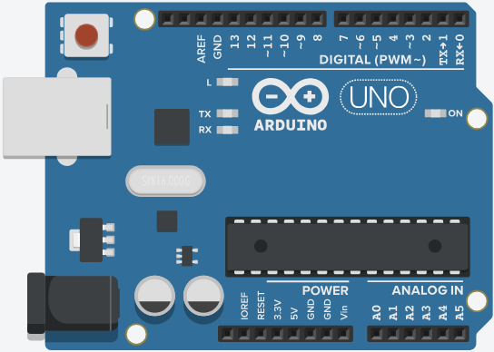
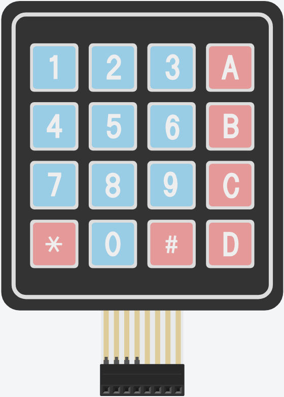
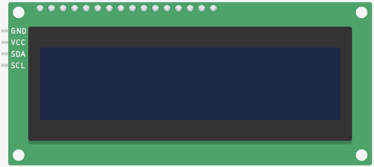
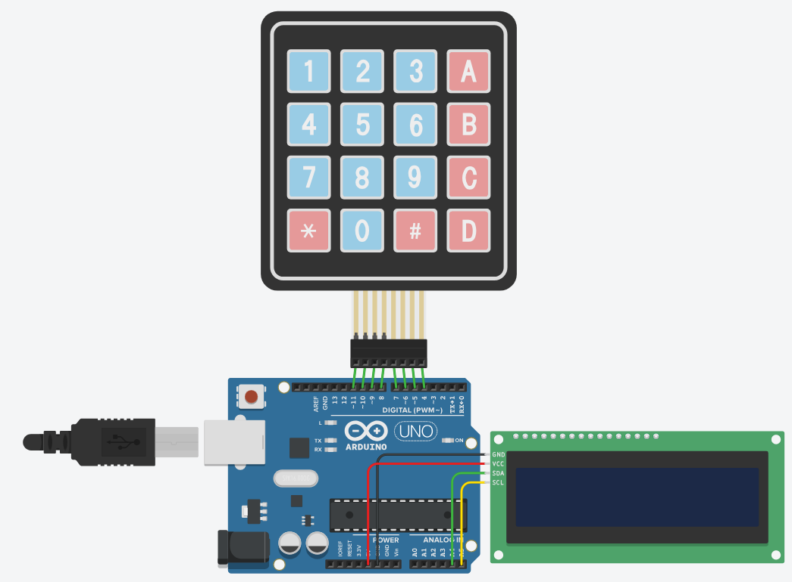

# 🔵 Kaprekar Arduino ⚪

A simple Arduino implementation of the Kaprekar routine using a keypad and LCD.

---

## 🔧 Arduino components

### Table
| Components           | Details | Price/unit (€) |  Qty | Total (€) |
| :------------------- | :------ | -------------: | ---: | --------: |
| Arduino Uno R4       |         |          20.00 |    1 |     20.00 |
| Arduino Keypad 4x4   |         |           2.00 |    1 |      2.00 |
| Arduino LCD I2C 20x4 |         |           8.00 |    1 |      8.00 |
| **Total**            |         |                |      | **30.00** |

### Arduino Uno R4

The microcontroller board used to run the Kaprekar algorithm.  


### Arduino Keypad 4x4

Used for user input to enter numbers and commands.  


### Arduino LCD I2C 20x4

Displays instructions and results to the user.  


### Scheme/Wiring



- **Keypad 4x4 (8 pins):**
  - First 4 pins → Rows
  - Last 4 pins → Columns
  - Connect to any digital pins (make sure to update the sketch accordingly)

- **LCD I2C 20x4 (4 pins):**
  - **VCC** → 5V
  - **GND** → GND
  - **SDA** → A4 (on Uno)
  - **SCL** → A5 (on Uno)

If you have another board, here is the table for SDA and SCL pins:  
| Board      |  SDA   |  SCL   |
| :--------- | :----: | :----: |
| UNO        | SDA/A4 | SCL/A5 |
| Nano       |   A4   |   A5   |
| MKR        |  D11   |  D12   |
| Mega & Due |  D20   |  D21   |

## 📦 Installation

> Step-by-step instructions to set up the project locally.  
> **Git** is required: [Download Git](https://git-scm.com/downloads)

```bash
# Navigate to the directory where you want to clone the project
cd C:/User/path/

# Clone the repository
git clone https://github.com/GueuleDeL0up/kaprekar-arduino
```

## 🛠️ Usage

> To run the application locally.  
> **Arduino IDE** is required: [Download Arduino IDE](https://www.arduino.cc/en/software)

### Upload the sketch

- Open `kaprekar-arduino/src/sketch/sketch.ino` in Arduino IDE. 
- Edit your keypad pin mappings in the sketch:
    ```arduino
    byte rowPins[ROWS] = { 52, 50, 48, 46 };  // Adjust based on your wiring
    byte colPins[COLS] = { 44, 42, 40, 38 };
    ```
- Select your board with the right COM port.
- Upload the sketch.

### Use

Once the upload is complete, follow the instructions on the Arduino LCD I2C 20x4.

We use the keypad in the following layout:
```arduino
|1|2|3|
|4|5|6|
|7|8|9|
|*|0|#|
```
- `*` → Validate input
- `#` → Backspace

## ℹ️ More Info

Author: `@GueuleDeL0up`  
Project version: `V0`  
GitHub: [@GueuleDeL0up](https://github.com/GueuleDeL0up)  
